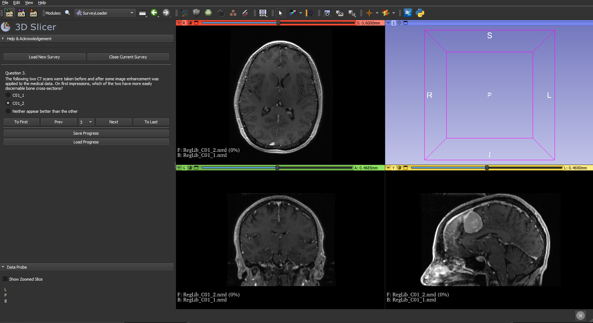

## 3D Slicer Survey Extension

**This documentation will cover the methods of installing the module, creating, taking, and saving surveys using this extension.**

---

## Installing the Extension

For this extension module, we aim to have it uploaded to the official 3D Slicer Extension Database so users will be able to easily download the survey module.

However, as we have not yet officially submitted an application, users will need to manually install this extension.

_For first-time users, please clone or download the repository from github onto your local device._

If you are unsure how to clone from the command line, see [Clone a repository](https://confluence.atlassian.com/x/4whODQ).

1. Open the 3D Slicer Application
2. Open the drop-down menu besides Modules.
3. Select Extension Wizard under Developer Tools
4. Click Select Extension Button
5. Uncheck developer mode
6. Choose the directory that contains the 'SurveyLoader' folder

---

## Creating a Survey

To create a survey, users must first create a CSV file containing the type, and all possible responses for every question.

The template **questions.csv** for this file can be found in the **questionnaire_1** folder located within **SurveyLoader/Resources/SurveyQuestions**.

Within **questions.csv**, users should be able see the first row containing the columns **question**, **type**, **images**, **choices**. Under each of these columns, users can input their survey questions and choices for a specific set of images.

**Questions**

Under the questions column, users are expected to input what the question is asking.

---

**Type**

This survey module has attempted to include a wide-range of question types to accomodate a more diverse range of questions survey creators can ask. The following questions types can be utilised:

- open: A text-box where users can answer open ended questions.

**No choices are expected, so the default input should be '[]'.**

- multi_single: A radiobutton question where only one choice is allowed.

- multi-multi: A radiobutton question where all choices are allowed.

- dropdown: A dropdown menu where users can select a single option.

**Please input all choices for this question within square brackets separated with commas. (['Answer A', 'Answer B', 'Answer C'])**

- slider: A slider where users can select a specific value within a pre-determined range.

**Please input the range for this question within square brackets separated with commas. ([Minimum, Maximum])**

- rating: A series of buttons where users are to select a single value within a pre-determined range.

**Please input the range and increment for this question within square brackets separated with commas. ([Minimum, Maximum, Increment])**

---

**Images**

Users can allocate a set of images/scans for each question within the CSV file.

**Under the _images_ column, users are expected to input the file name of the images.(['FileA.MHA', FileB.MHA'])**

**NOTE:** _All images (MHA Files) are expected to be within the same directory containing the **question.csv** file._

---

## Completing the Survey

Users can navigate the survey using the following buttons:

To Start: Will navigate to first question.
Prev: Will navigate to previous question.
Next: Will navigate to next question.
To Last: Will navigate to last question.

**NOTE:** _All answers will be saved locally until user saves into a file. If users exit the application or survey before saving, the answers will **NOT** be saved._

---

## Saving the Survey

After users have completed the survey, they are expected to save using the Save File button, which will prompt them to input a file name. Once filled, the file will be saved using CSV format in the **Results** folder which is located within **SurveyLoader/Results**.

The results CSV file will contain a single column containing all questions and answers.

---

## Resuming the Survey

If users have previously saved their progress for a particular survey, users can resume their progress at a later time.

Users **MUST** first load in the same survey questions they were previously working on.

After loading in the survey users can load in progress using the **Load Progress** button and select the CSV file containing the answers they previously saved.

**Now that you're more familiar with the Survey Extension, go ahead and create a new survey!**

---

## Acknowledgements

This module was developed by a team of computer science students supervised by Owen Dillon as part of their capstone project. They are:

Felix Benter <fben0403@uni.sydney.edu.au>

Edward Lai <elai7018@uni.sydney.edu.au>

Rick Fu <jifu9071@uni.sydney.edu.au>

Will Wang <XWAN5753@UNI.SYDNEY.EDU.AU>

Daniel Qiu <yqiu6302@uni.sydney.edu.au>

Kevin Min <tmin0129@uni.sydney.edu.au>
